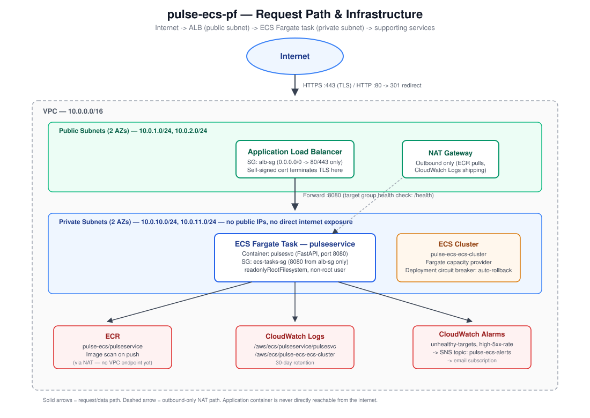
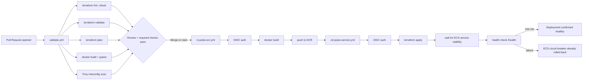
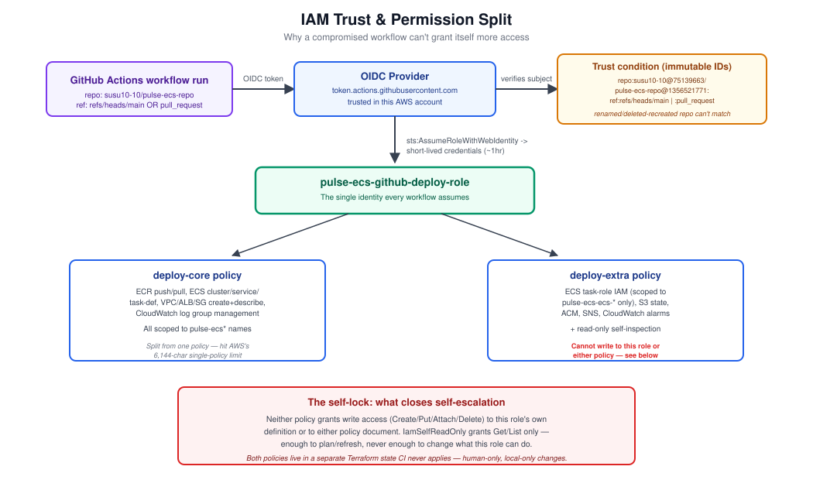

# Pulse-Ecs-Repo

[](https://github.com/susu10-10/pulse-ecs-repo/actions/workflows/cd-pulse-service.yml) [](https://github.com/susu10-10/pulse-ecs-repo/actions/workflows/ci-pulse-ecr.yml) [](https://github.com/susu10-10/pulse-ecs-repo/actions/workflows/validate.yml)

A production-style AWS deployment platform for a small backend service, built from scratch for the Finzla Cloud & Platform Engineer technical assessment: containerized app, Terraform-managed infrastructure, a full GitHub Actions CI/CD pipeline with OIDC authentication, least-privilege IAM, and monitoring.

**Live at time of writing:** `https://pulse-ecs-alb-2082969188.us-east-1.elb.amazonaws.com/health` (self-signed certificate, see [TLS](#tls--certificates) below for why, and use `curl -k` or accept the browser warning).

---

## Table of Contents

1. [Architecture](#1-architecture)
2. [Request Path](#2-request-path-internet---aws---application)
3. [Application](#3-application)
4. [Terraform](#4-terraform)
5. [CI/CD Pipeline](#5-cicd-pipeline)
6. [Security & Operations](#6-security--operations)
7. [Monitoring](#7-monitoring)
8. [Incident Investigation](#8-incident-investigation-exercise)
9. [Engineering Judgement](#9-engineering-judgement)
10. [Repository Structure](#10-repository-structure)
11. [Evidence](#11-evidence)

---

## 1. Architecture



**Chosen architecture: ECS on Fargate**, behind an internet-facing Application Load Balancer, in a purpose-built VPC with public and private subnets.

### Why ECS Fargate

- No cluster nodes to patch, size, or manage Fargate abstracts the EC2 layer entirely, which matters for a small team running a small number of services.
- The assessment brief explicitly rewards a **smaller, well-understood solution** over unnecessary complexity. A single backend service doesn't need Kubernetes' scheduling, CRD, or multi-tenancy capabilities.
- Fast to reason about in a 30–45 minute technical review: cluster → service → task definition → container is a shallow, linear mental model compared to explaining a Kubernetes control plane, CNI, and admission chain.

### Rejected alternative: EKS

EKS was considered and rejected for this specific scope. It adds real value at the point where you have many services, need custom scheduling behaviour, or want to standardize on Kubernetes across a polyglot fleet none of which apply to a single two-endpoint HTTP service. Standing up and securing an EKS control plane, node groups (or Fargate profiles), and cluster-level IAM (IRSA) would have roughly tripled the surface area of this submission for no corresponding benefit to the actual workload. If this service grows into a genuine multi-service platform, EKS becomes a much stronger argument it isn't a bad technology, it's the wrong-sized tool for this job today.

### Components

| Component | Purpose |
|---|---|
| VPC (`10.0.0.0/16`) | Network boundary, 2 AZs |
| Public subnets | Host the ALB and the NAT Gateway only |
| Private subnets | Host the ECS Fargate task no public IP, no route to the internet except via NAT |
| Application Load Balancer | TLS termination, health checking, HTTP→HTTPS redirect |
| ECS Cluster + Fargate Service | Runs the container, deployment circuit breaker enabled |
| ECR | Private image registry, scan-on-push enabled |
| CloudWatch Logs | Container and cluster logs |
| CloudWatch Alarms + SNS | Alerting on unhealthy targets and elevated error rates |
| ACM (self-signed) | TLS certificate for the ALB listener |
| IAM (split policies + OIDC) | Scoped, auditable permissions for GitHub Actions and the ECS tasks |

---

## 2. Request Path: Internet → AWS → Application

1. A client resolves the ALB's DNS name and opens a TCP connection on **port 443** (or 80, which is redirected).
2. The **security group on the ALB** (`alb-sg`) only accepts inbound traffic on 80 and 443 from `0.0.0.0/0` nothing else reaches it.
3. The ALB terminates TLS using the certificate imported into ACM, then forwards the decrypted request to its **target group** on port 8080.
4. The target group holds the IP of the currently running **ECS Fargate task**, which lives in a **private subnet** with no public IP address and no route to the internet other than outbound-only via the NAT Gateway.
5. The **security group on the ECS task** (`ecs-tasks-sg`) only accepts inbound traffic on port 8080, and only from the ALB's security group not from any CIDR range, not from the internet, not from any other source. This is the mechanism that satisfies "the application container itself must not be directly exposed to the public internet": there is no path to the container that doesn't first pass through the ALB.
6. The FastAPI application inside the container handles the request and returns a response, which the ALB relays back to the client over the same TLS connection.
7. Outbound-only traffic from the task (pulling images from ECR, shipping logs to CloudWatch) goes through the NAT Gateway in the public subnet the task itself is never reachable from that direction.

---

## 3. Application

A deliberately minimal FastAPI service the brief is explicit that application functionality isn't the focus.

- `GET /health` → `200 {"status": "ok"}`, used as the ALB target group health check
- `GET /version` → returns `version`, `git_commit`, `build_number`, `env`, and server timestamp version/commit are injected at Docker build time via build args, not hardcoded
- Reads `APP_ENV` from the environment (currently `production` in this deployment)
- Logs to stdout only no file logging, so container logs flow directly to CloudWatch via the `awslogs` driver
- No secrets, credentials, or tokens anywhere in the source code

**Dockerfile:** multi-stage build (separate build/runtime stages keep the final image lean), runs as a non-root user (`appuser`, uid 1000), and the container filesystem is mounted read-only at the ECS task level (`readonlyRootFilesystem = true`) the app has no legitimate reason to write to its own filesystem, so that capability is removed entirely rather than left available-but-unused.

---

## 4. Terraform

### Structure

Flat files per AWS service area within each root, numbered for reading order (`01_iam.tf`, `02_ecr.tf`, `03_vpc.tf`, …) rather than nested modules chosen deliberately over a modules/ directory structure because this is a single-environment, single-service deployment; modules earn their complexity when the same infrastructure shape needs to be instantiated more than once; here it doesn't yet.

The repository actually contains **two separate Terraform roots**, each with its own state:

```
terraform/
└── envs/
    └── prod/
        ├── 01_iam.tf          # ECS task execution + task roles (app-level IAM)
        ├── 02_ecr.tf          # Container registry
        ├── 03_vpc.tf          # Network
        ├── 04_sg.tf           # Security groups
        ├── 05_alb.tf          # Load balancer, listeners, target group
        ├── 06_acm.tf          # Self-signed certificate
        ├── 07_ecs.tf          # ECS cluster
        ├── 08_appservice.tf   # ECS service + task definition
        ├── 09_monitoring.tf   # SNS + CloudWatch alarms
        ├── backend.tf         # S3 remote state for THIS root
        ├── provider.tf
        └── variables.tf
        └── permissions/       # SEPARATE root, separate state
            ├── oidc.tf        # GitHub OIDC provider, deploy role, both policies
            ├── backend.tf     # DIFFERENT S3 bucket/key from the root above
            ├── provider.tf
            └── variables.tf
```

**Why two roots, not one:** the `permissions/` root defines the exact IAM identity that GitHub Actions authenticates as. If it lived in the same state as the application infrastructure, every CI run would need to be able to *read* those IAM resources just to compute a plan but that same CI identity must never be able to *write* to its own permissions (see the [blast radius discussion](#most-security-sensitive-role) below). Splitting it into its own root, applied only from a human's local machine, makes self-privilege-escalation structurally impossible rather than merely policy-forbidden. This was the direct result of hitting that exact self-referential problem during development see the note on `IamSelfReadOnly` below.

### Remote Terraform state

Both roots use an S3 backend with versioning and encryption enabled on the bucket, and S3's native state locking (`use_lockfile = true`) to prevent concurrent applies from corrupting state no separate DynamoDB lock table needed on current Terraform versions.

### State locking and concurrent changes

S3-native locking means a `terraform apply` acquires an exclusive lock on the state file for the duration of the operation; a second concurrent `apply` against the same backend blocks (or fails, depending on timeout settings) rather than racing. Combined with the two-root split above, there are two independent lock domains a human applying a permissions change and CI applying an infrastructure change can never contend for the same lock, because they're different state files entirely.

### Development and production environments

This submission deploys a single `prod` environment, for scope reasons given assessment time constraints but the structure is built to extend cleanly: a hypothetical `envs/dev/` directory would mirror `envs/prod/`'s files, with its own `backend.tf` pointing at a different state key (e.g. `pulse-ecs/dev/terraform.tfstate`) and a `terraform.tfvars` supplying dev-sized values (smaller task CPU/memory, `single_nat_gateway = true` unconditionally, a separate ECR repository namespace). Both environments would be applied through the same CI workflow, parameterized by which directory it targets, with production gated behind the GitHub Environment protection rule described below.

### No hardcoded credentials / secure handling of sensitive values

- Zero AWS access keys anywhere in the repository authentication is exclusively via GitHub's OIDC token exchanged for short-lived STS credentials
- Two values that *are* sensitive-ish (numeric GitHub owner/repo IDs, used to construct the OIDC trust condition) are passed as `TF_VAR_owner_id` / `TF_VAR_repo_id` from GitHub Actions repository secrets, never committed
- The self-signed certificate's private key is generated at apply time by the `tls_private_key` resource and only ever exists inside Terraform state (itself encrypted at rest in S3) and inside ACM never written to a file or logged

### Minimal unnecessary duplication

The two-root split intentionally shares nothing structurally: `permissions/` doesn't know about the VPC, ALB, or ECS resources at all, and `envs/prod/` doesn't define any IAM identity resources it only *references* the role ARN that CI assumes. Each root's `variables.tf` only declares variables that root actually uses (trimmed deliberately after an earlier draft accidentally carried unrelated variables like `domain_name` into the permissions root).

---

## 5. CI/CD Pipeline



### The three workflows

| Workflow | Trigger | Does |
|---|---|---|
| `validate.yml` | Pull request to `main` | `terraform fmt -check`, `init`, `validate`, `plan` (using the deploy role, read-only in effect since this job never runs `apply`); Docker build + `pytest` against the FastAPI app; Trivy misconfiguration scan over `terraform/` |
| `ci-pulse-ecr.yml` | Push to `main` touching `app/**` | Builds the Docker image, authenticates to ECR via OIDC, pushes |
| `cd-pulse-service.yml` | Push to `main` touching `terraform/**`, or manual dispatch | `terraform init/plan/apply` against `envs/prod`, waits for ECS service stability, then polls `/health` through the ALB with retries |

### Confirming health and handling an unhealthy deployment

Two layers, deliberately not just one:

1. **ECS's own deployment circuit breaker** (`deployment_circuit_breaker = { enable = true, rollback = true }` on the service) is the actual recovery mechanism if a new task definition's containers keep failing their target-group health check, ECS halts the deployment and automatically reverts to the last stable revision, without any custom scripting.
2. **The pipeline's own health-check step** (`curl` against `/health` through the ALB, with retries) exists for *visibility*, not recovery it's what makes an unhealthy deployment show up as a failed, red CI run rather than a silent, "successful" `terraform apply` that quietly leaves customers getting 503s. If this step fails, the circuit breaker has almost certainly already acted; the failing CI job is the pipeline surfacing that event to a human, not the thing fixing it.

### GitHub → AWS authentication

OIDC exclusively. No long-lived AWS access keys exist anywhere in this project. GitHub Actions requests a short-lived OIDC token, which is exchanged via `sts:AssumeRoleWithWebIdentity` for temporary credentials scoped to exactly one IAM role.

### What prevents another repository, a compromised workflow, or an individual developer from freely deploying into production

Several independent layers, each closing a different gap:

- **The OIDC trust condition is scoped to this exact repository and branch**, using GitHub's *immutable* subject format (`repo:OWNER@OWNER_ID/REPO@REPO_ID:ref:refs/heads/main`, plus a `:pull_request` variant for PR-time planning). This isn't just "repo name matches" it's tied to the numeric, immutable GitHub owner and repository IDs, which means even if this repository were deleted and a new one created with the identical name, the old trust relationship could never be satisfied by the new repo's tokens. A different repository, however similarly named, can never mint a token this role's trust policy accepts.
- **The deploy role's own permissions cannot modify themselves.** The IAM policy attached to the deploy role explicitly excludes write access to its own role and both of its own policy documents (see `IamSelfReadOnly` vs. the write-capable `IamForProjectRolesOnly` statement in `permissions/oidc.tf`) a compromised workflow run assuming this role cannot grant itself additional permissions, rotate its own trust policy, or attach a broader managed policy to itself. This was deliberately tested during development: an attempt to have CI modify its own policy failed with `AccessDenied`, exactly as designed.
- **The permissions themselves live in a Terraform root CI never applies.** Even if somehow permission were granted, the `permissions/` root uses a separate state file that no CI workflow in this repository ever runs `apply` against only a human, locally, with independent credentials, can change what this role is allowed to do.
- **Branch protection on `main`** requires the PR validation checks to pass and a review before merge a direct push bypassing review isn't part of the normal path.
- **A GitHub Environment protection rule** on the `production` deployment target supports requiring a manual approver before `cd-pulse-service.yml`'s apply step runs, layering a human gate on top of the technical controls above.


## 6. Security & Operations

### Least-privilege IAM

The GitHub Actions deploy role is backed by **two managed policies** (`pulse-ecs-github-deploy-core`, `pulse-ecs-github-deploy-extra`) rather than one a direct, practical consequence of hitting AWS's 6,144-character limit on a single managed policy as the permission set grew through iterative development. Splitting along logical lines (core compute/network/container vs. IAM/state/monitoring/misc) rather than combining into a wildcard grant was the deliberate choice at every step of that growth.

Every statement is scoped as tightly as the underlying AWS API allows:

- Resource ARNs are scoped to `${project_name}*` name prefixes wherever AWS supports resource-level permissions (ECR repositories, ECS services, CloudWatch log groups and alarms, SNS topics, ACM certificates, the two project-specific IAM roles)
- Where AWS genuinely does not support resource-level scoping for an action (documented in-line in the policy with a comment at each occurrence e.g. `ecs:RegisterTaskDefinition`, most EC2/ELB create-and-describe calls, `logs:DescribeLogGroups`, `route53:ListHostedZones`), the statement is still scoped down to only the specific actions actually used, never a service-wide wildcard like `ec2:*` or `elasticloadbalancing:*`
- IAM management permissions are scoped to only the two ECS task roles' name pattern (`${project_name}-ecs-*`) the deploy role cannot create, modify, or attach policies to *any other* role in the account

### Most security-sensitive role



**The GitHub Actions deploy role (`pulse-ecs-github-deploy-role`).**

1. **What it can do:** push images to this project's ECR repository; create/update/delete the VPC, subnets, security groups, ALB, ECS cluster and service, this project's two ECS task IAM roles, CloudWatch log groups and alarms, an SNS topic, and a self-signed ACM certificate; read and modify one specific Route 53 hosted zone record set.
2. **Why those permissions are required:** this is the complete set of AWS resource types the Terraform configuration manages nothing is granted "just in case."
3. **What could happen if it were compromised:** an attacker with this role's credentials could deploy an arbitrary container image to the running service, modify network/security-group rules within this project's scope, or tear down and recreate the application's infrastructure. They could **not** access any other AWS service in the account, could not read or modify IAM outside this project's two task roles, could not touch the state bucket's bucket policy, could not modify or read the deploy role's own permissions, and could not pivot to any other project in this AWS account.
4. **What limits its blast radius:** every resource ARN is scoped to a `pulse-ecs*` naming prefix; the role's own IAM identity (itself and both attached policies) is completely excluded from its own write permissions, closing the self-escalation path explicitly; credentials are short-lived (an OIDC-issued STS token, typically expiring within the hour) rather than a standing access key that persists until manually rotated; and the trust policy only issues those credentials to workflow runs from this specific repository's `main` branch or pull requests, using GitHub's immutable repo/owner ID subject format.

### Security groups

- `alb-sg`: inbound 80/443 from `0.0.0.0/0` only (the ALB must be reachable); all other inbound denied by default
- `ecs-tasks-sg`: inbound 8080 **only from `alb-sg`**, not from any CIDR block the task literally cannot receive a connection that didn't originate at the load balancer

### TLS / certificates

The ALB terminates TLS using a **self-signed certificate**, imported into ACM. This was a deliberate simplification made partway through the build: an initial design used a real subdomain of an unrelated, already-live project's Route 53 hosted zone for DNS-validated ACM certification but sharing that hosted zone (and the IAM permissions needed to manage records in it) created an unnecessary cross-project coupling and a meaningfully larger IAM surface for no benefit to this assessment's actual scope. Removing that dependency in favour of a self-signed certificate on the ALB's own AWS-issued DNS name eliminated an entire category of Route 53 permissions and a live dependency on infrastructure outside this project's control.

**Honest tradeoff:** browsers and strict HTTP clients will flag the certificate as untrusted, since there's no CA chain behind it (`curl` needs `-k`). A production deployment for a real fintech platform would use a properly owned domain with DNS-validated ACM certification instead this is explicitly called out again in [Production Readiness](#production-readiness) below as one of the top improvements before this environment is production-ready.

### Encryption

- S3 state bucket: server-side encryption enabled, versioning enabled (both Terraform state buckets)
- ECR: image scanning on push (vulnerability scanning, not encryption per se, but the relevant "scan for risk" control for container images)
- In-transit: TLS on the ALB listener for all external traffic

### Secrets management

No secrets exist in source code or Terraform files. The two values that resemble secrets (GitHub numeric owner/repo IDs) are stored as GitHub Actions repository secrets and injected as `TF_VAR_*` environment variables at workflow runtime they're not credentials, but they participate in the OIDC trust condition, so they're handled with the same discipline.

### Separation between environments

Addressed in [Section 4](#development-and-production-environments) above single environment deployed for this submission, structure designed to extend to a second without restructuring.

---

## 7. Monitoring

### Metrics tracked (3)

| Metric | Namespace | What it shows |
|---|---|---|
| `UnHealthyHostCount` | `AWS/ApplicationELB` | Targets currently failing their health check |
| `HTTPCode_Target_5XX_Count` | `AWS/ApplicationELB` | Server errors originating from the application itself, not the ALB |
| `TargetResponseTime` | `AWS/ApplicationELB` | Request latency from the ALB's perspective tracked for visibility, not directly alarmed |

### Alerts (2)

**1. Unhealthy targets** (`pulse-ecs-unhealthy-targets`)

- **Trigger:** 1 or more unhealthy targets, sustained for 2 consecutive 1-minute periods
- **Why it matters:** this is the direct precursor to customer-facing 503s catching it here means responding before customers notice, not after
- **Who receives it:** on-call platform engineer, via the `pulse-ecs-alerts` SNS topic's email subscription
- **First investigation step:** check the failing target's health-check reason in the target group console, then cross-reference ECS task logs for the same time window

**2. Elevated 5xx rate** (`pulse-ecs-high-5xx-rate`)

- **Trigger:** more than 5 target-origin 5xx responses within a 5-minute window
- **Why it matters:** direct customer impact rather than just an infrastructure-state signal a target can register as "healthy" while still returning application-level errors, so this catches a class of problem the first alarm cannot
- **Who receives it:** on-call platform engineer, same SNS topic
- **First investigation step:** check ECS task logs for the same window and correlate the timestamp against the most recent deployment

### Logs location and retention

- Container application logs: CloudWatch Logs, `/aws/ecs/pulseservice/pulsesvc`
- ECS cluster-level logs: `/aws/ecs/pulse-ecs-ecs-cluster`
- **Retention: 30 days.** Chosen as a pragmatic balance between having enough history to investigate an incident discovered a few weeks late, and CloudWatch Logs storage cost. A regulated fintech production environment would likely extend this considerably (and route to a cheaper long-term store like S3 + Glacier for anything beyond active-investigation timeframes) to meet compliance retention requirements noted again in Production Readiness.

---

## 8. Incident Investigation Exercise

**Scenario:** GitHub Actions reports deployment successful. ECS reports the expected number of tasks running. Customers are receiving HTTP 503 errors, and the load balancer reports unhealthy targets.

**1. What I would investigate first:** the ALB target group's health check configuration versus what the newly deployed container actually does on the configured health check path and port. A mismatch here is the single most common cause of exactly this symptom pattern (deployment "succeeds," tasks "run," but nothing is actually serving traffic correctly).

**2. Which AWS services, logs, or metrics I'd inspect:**

- ALB target group health check settings (path, port, expected status code) compared against the task definition's actual container port and the application's real health endpoint
- ECS task logs in CloudWatch for the affected tasks, specifically looking for startup errors or crash loops in the window right after deployment
- ECS service events (`aws ecs describe-services`) for any warnings about failed health checks or repeated task replacement
- The security group attached to the ECS tasks, to rule out a network-layer block between the ALB and the container

**3. At least three possible causes:**

- The new task definition changed the container's listening port, but the target group's configured port wasn't updated to match
- The application is crashing shortly after startup (missing environment variable, dependency failure) ECS shows the task as "running" briefly before it dies and gets replaced, so the reported task count can look healthy in a point-in-time snapshot while the tasks are actually cycling
- A security group rule was inadvertently tightened or misconfigured, blocking the ALB from reaching the task on the expected port even though both the ALB and the task are individually healthy

**4. How I'd prove or eliminate each:**

- Compare the task definition's `containerPort` against the target group's configured port directly a numeric mismatch is immediately visible and conclusive
- Pull the task's CloudWatch logs for the exact timestamp range since the deployment; a crash loop shows as repeated startup-then-exit log patterns, and ECS's own task state history shows repeated `STOPPED` events with a reason code
- Attempt a connection to the task's port from inside the VPC (e.g. via ECS Exec into another task in the same security group, or a temporary bastion) to isolate whether the block is at the security-group layer specifically, independent of application health

**5. The safest immediate recovery action:** roll back to the previous task definition revision (`aws ecs update-service --task-definition <previous-revision>`) rather than attempting to debug forward while customers are actively affected. In this project's actual setup, the ECS deployment circuit breaker should have already done this automatically if it hasn't, that's itself worth investigating as a secondary finding, since it suggests the circuit breaker's health-check-failure threshold wasn't met even though real user traffic is failing, meaning the target group's health check may not be representative of true application health.

**6. How I'd prevent the same issue reaching customers again:** this pipeline's own health-check step (Section 5) is the direct mitigation a deploy that produces unhealthy targets now fails the CI job visibly rather than silently reporting success, closing the exact gap this scenario describes ("GitHub Actions reports deployment successful" while customers are actually broken). Beyond that: aligning the target group's health check path/port validation into the PR-time `terraform plan` review (so a port mismatch is caught before merge, not after deploy), and considering a canary or bake-time step before shifting full traffic to a new revision.

---

## 9. Engineering Judgement

### Architecture

Covered in full in [Section 1](#1-architecture) ECS Fargate chosen for operational simplicity matching the actual scope of a single service; EKS rejected as disproportionate complexity for that scope, not as a weaker technology in general.

### Reliability

If a new deployment starts but fails its health checks, the ECS **deployment circuit breaker** (enabled on the service, `rollback = true`) detects the repeated health-check failures during the deployment and automatically halts it, reverting the service to the last stable task definition revision without needing a human to notice and intervene. The pipeline's own post-deploy health check (Section 5) provides visibility into this happening, surfacing it as a failed CI run. Manual rollback, if ever needed beyond the automatic path, is a single `aws ecs update-service --task-definition <previous-revision>` command, since every past task definition revision remains registered and immediately reusable.

### Cost

The two largest likely cost drivers in this design:

1. **NAT Gateway** charged both hourly and per-GB of data processed. This design deliberately uses a single shared NAT Gateway (`single_nat_gateway = true`) rather than one per AZ, trading full AZ-level resilience for meaningfully lower cost an AZ outage affecting the NAT's subnet would affect outbound connectivity VPC-wide, which is an accepted tradeoff at this scale and traffic volume, but the first thing to reconsider at higher scale or stricter availability requirements.
2. **Application Load Balancer** hourly charge plus LCU (Load Balancer Capacity Unit) charges that scale with connection count, bandwidth, and rule evaluations. At this traffic level the cost is negligible, but it's a fixed cost that exists regardless of how little traffic the service receives.

Controlling both: right-sizing Fargate task CPU/memory rather than over-provisioning (currently 256 CPU units / 512 MB, appropriate for a two-endpoint service), keeping the single-NAT tradeoff rather than paying for per-AZ redundancy this workload doesn't yet need, and avoiding idle over-provisioned minimum task counts.

### Production Readiness

The three most important improvements before considering this environment production-ready for a fintech platform:

1. **Replace the self-signed certificate with a real, domain-validated one.** This is the single most visible gap for a fintech product specifically customers and any compliance auditor will immediately flag an untrusted certificate. Requires owning a domain and completing ACM's DNS validation against it, which was deliberately deferred here to avoid an unnecessary cross-project Route 53 dependency (see [TLS](#tls--certificates)), but is a hard requirement before real customer traffic.
2. **Multi-account separation, not just multi-environment.** Right now dev and prod (were dev built out) would share one AWS account; a regulated fintech platform should isolate production into its own AWS account entirely, with cross-account IAM roles for CI rather than a single account's IAM boundary being the only thing separating environments.
3. **Extend log retention and add a WAF in front of the ALB.** 30-day CloudWatch retention is reasonable for operational debugging but almost certainly insufficient for fintech compliance/audit requirements pairing shorter hot storage with long-term archival (S3 + lifecycle policies to Glacier) addresses both cost and compliance. A WAF adds a layer of protection (rate limiting, common exploit signatures) that a bare ALB doesn't provide on its own, which matters more once real payment-adjacent traffic is involved.

---

## 10. Repository Structure

```
.
├── README.md
├── docs/
│   └── architecture-diagram.svg
├── app/
│   ├── Dockerfile
│   ├── requirements.txt
│   ├── requirements-dev.txt
│   └── src/
│       ├── main.py
│       └── test_main.py
├── terraform/
│   └── envs/
│       └── prod/
│           ├── 01_iam.tf ... 09_monitoring.tf
│           ├── backend.tf
│           ├── provider.tf
│           ├── variables.tf
│           └── permissions/
│               ├── oidc.tf
│               ├── backend.tf
│               ├── provider.tf
│               └── variables.tf
└── .github/
    └── workflows/
        ├── validate.yml
        ├── ci-pulse-ecr.yml
        └── cd-pulse-service.yml
```

---

## 11. Evidence

- `terraform plan` / `terraform apply` output: captured throughout development, available on request or in commit history
- Successful `docker build`: confirmed locally and in `validate.yml`'s CI run
- CI workflow results: visible in the repository's Actions tab `validate.yml`, `ci-pulse-ecr.yml`, and `cd-pulse-service.yml` all have green runs
- Live health check, captured at time of writing:

```
$ curl -k https://pulse-ecs-alb-2082969188.us-east-1.elb.amazonaws.com/health
{"status":"ok"}

$ curl -k https://pulse-ecs-alb-2082969188.us-east-1.elb.amazonaws.com/version
{"version":"0.0.0","git_commit":"unknown","build_number":"unknown","env":"prod","server_time_utc":"2026-09-06T14:19:55.875697+00:00"}
```

- Monitoring: `pulse-ecs-alerts` SNS topic and both CloudWatch alarms (`pulse-ecs-unhealthy-targets`, `pulse-ecs-high-5xx-rate`) confirmed created and active in the AWS console